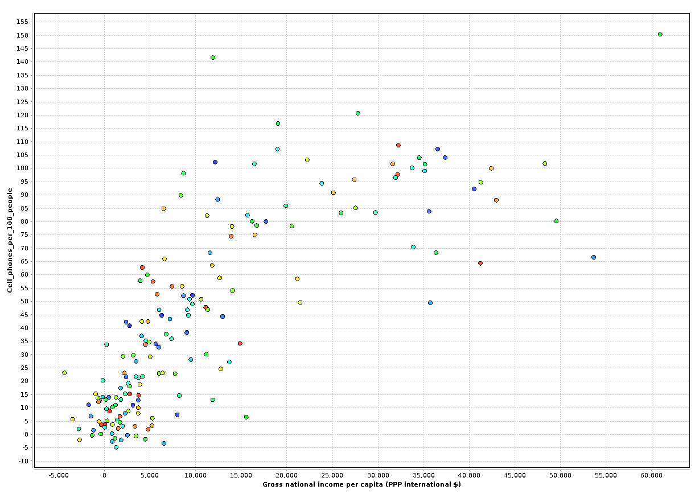

#Resultado 1

##1. Lo que se quiere encontrar

La relación entre los atributos: **Ingreso nacional bruto per cápita** (Gross national income per capita), **Teléfonos celulares por cada 100 personas** (Cell-phones-per-100-people), **País** (Country).

##2. Gráfico

##3. Conclusión

El acceso a la tecnología, en este caso concreto a un teléfono celular, se ve afectado por el ingreso nacional per cápita. Lo que significa que, **a menor ingreso nacional per cápita es menor la cantidad de personas que cuentan con un teléfono celular**. También se puede observar que a nivel mundial es mayor la cantidad de paises que se encuentra en esta situación, siendo muy pocos los que presentan un ingreso per cápita mayor y consecuentemente mayor el número de personas en su población que cuentan con un teléfono celular.
