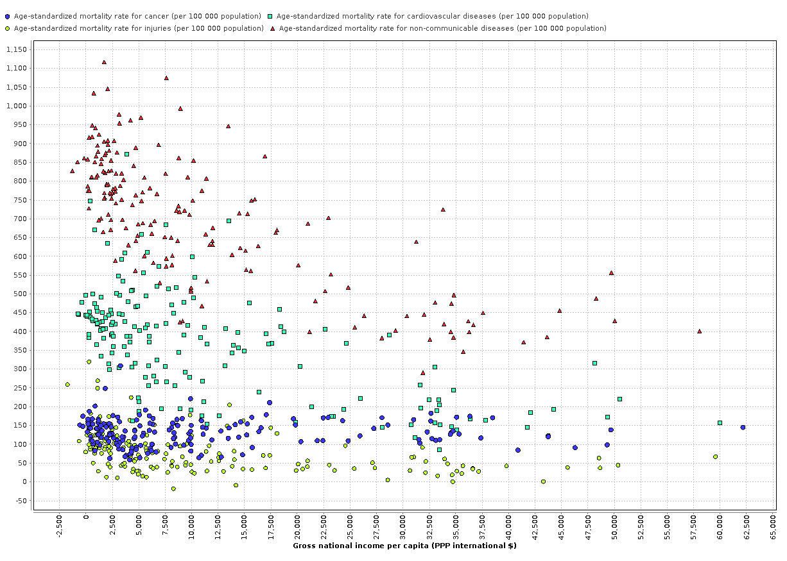

#Resultado 2

##1. Lo que se quiere encontrar

La relación entre los atributos: **Ingreso nacional bruto per cápita** (Gross national income per capita), **Tasa de mortalidad estandarizada por edad para el cáncer** (Age-standardized mortality rate for cancer), **Tasa de mortalidad estandarizada por edad para las enfermedades cardiovasculares** (Age-standardized mortality rate for cardiovascular diseases ), **Tasa de mortalidad estandarizada por edad por lesiones** (Age-standardized mortality rate for injuries), **Tasa de mortalidad estandarizada por edad para las enfermedades no transmisibles** (Age-standardized mortality rate for non-communicable diseases).

##2. Gráfico

##3. Conclusión

**Cuanto menor es el ingreso nacional bruto per cápita, mayor la tasa de mortalidad relacionada con el cáncer, enfermedades cardiovasculares, por lesiones y enfermedades no transmisibles**. Asimismo y no menos importante, se observa que si bien la tasa de mortalidad relacionada con esas enfermedades en menor en países donde el ingreso nacional per cápita es mayor, no dejan de estar presentes.
