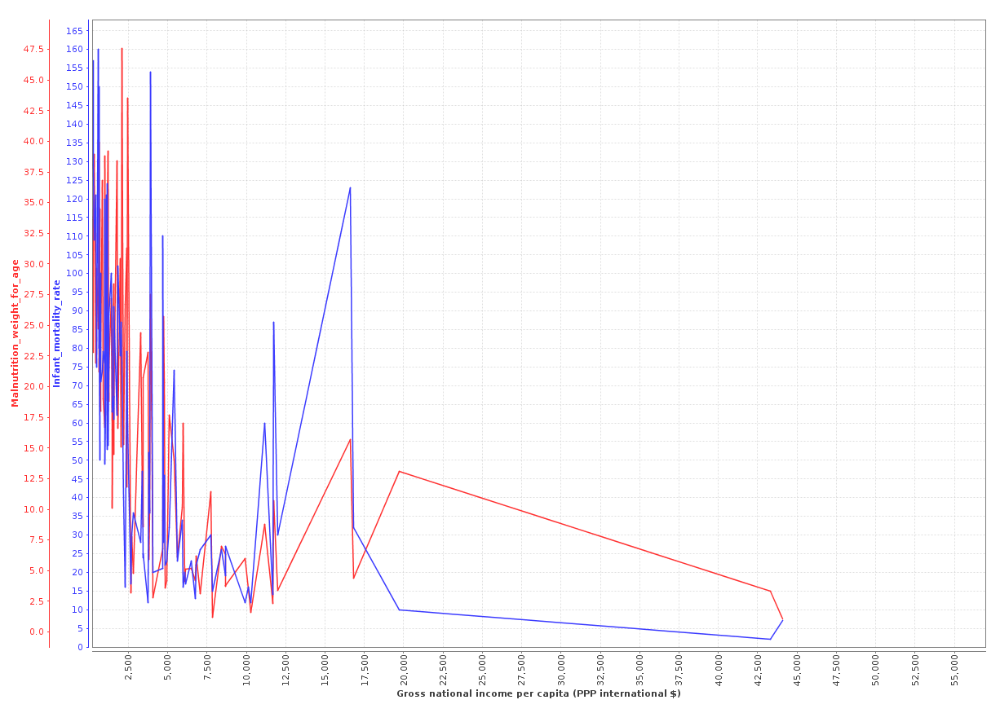
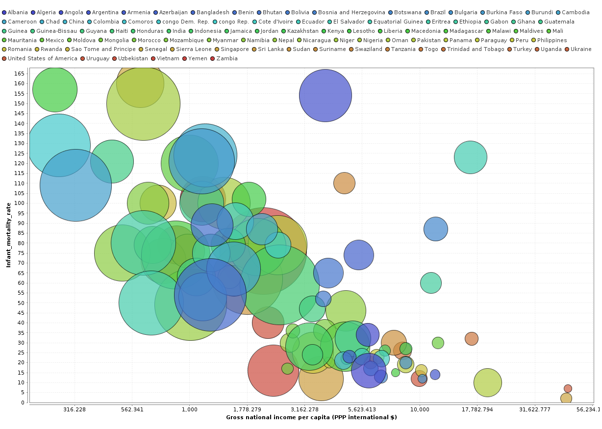

#Resultado 3

##1. Lo que se quiere encontrar

La relación entre los atributos: **Ingreso nacional bruto per cápita** (Gross national income per capita), **Tasa de mortalidad infantil** (Infant-mortality-rate), **La desnutrición de peso para la edad** (Malnutrition-weight-for-age), **País** (Country).

##2. Gráficos

(a)

(b)

##3. Conclusión

A menor ingreso nacional bruto per cápita, mayor la tasa de mortalidad infantil y desnutrición. También, se puede observar que la desnutrición incrementa la tasa de mortalidad infantil en los diferentes países del mundo.

> En el gráfico (b), el diámetro de la burbuja esta determinada por el indice de desnutrición.

